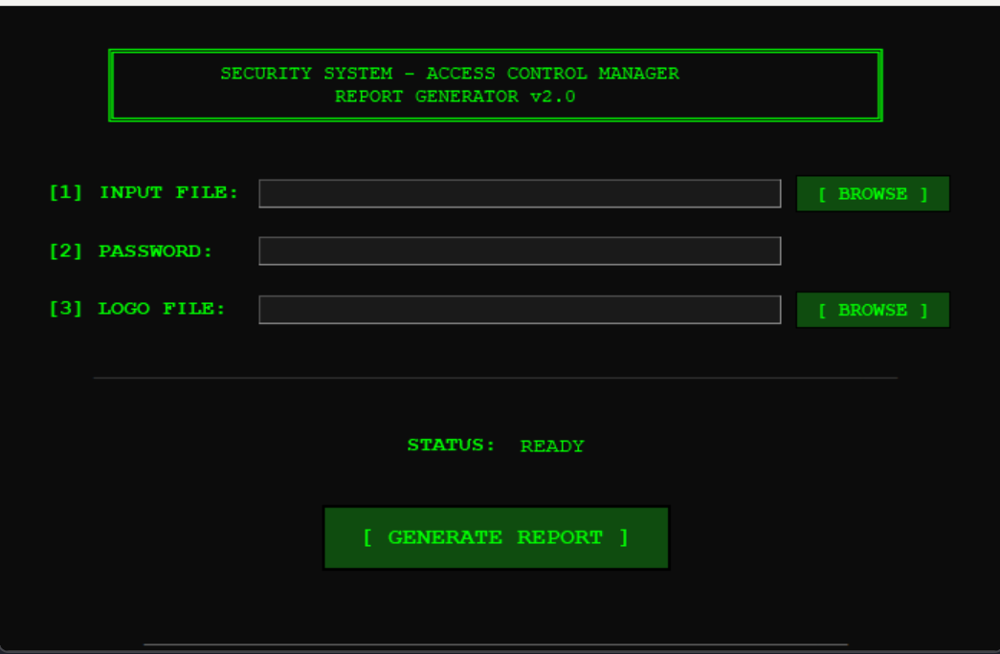

# Security System Passcode Manager

A Python-based report generator that converts security system user export files into interactive, password-protected HTML reports with full editing capabilities.

## Features

- **Parse Export Files**: Processes comma-separated text files containing user access data
- **Interactive HTML Reports**: Generate self-contained HTML reports with:
  - Password protection
  - In-browser editing capabilities
  - User management (add/remove/edit)
  - Authority level dropdown selectors (A1-A8)
  - Visual tracking of modifications
  - Pagination for large datasets
- **Zero Dependencies**: Uses only Python standard library
- **Security Focused**: HTML escaping, input validation, and CSP headers
- **Professional UI**: Clean, modern interface with retro-styled GUI

## Requirements

- Python 3.6 or higher
- No external dependencies required

## Installation

1. Clone the repository:
```bash
git clone https://github.com/yourusername/rpsreporter.git
cd rpsreporter
```

2. Run the application:
```bash
python userreporter.py
```

## Usage

1. **Launch the Application**
   - Run `python userreporter.py`
   - A GUI window will open

2. **Select Input File**
   - Click `[BROWSE]` to select your text file containing user data
   - File should be comma-separated with user information

3. **Set Password (Optional)**
   - Enter a password to protect the HTML report
   - Leave blank for no password protection

4. **Add Logo (Optional)**
   - Select an image file (PNG, JPG, GIF)
   - Images under 100KB recommended for best performance

5. **Generate Report**
   - Click `[GENERATE REPORT]`
   - Choose save location for the HTML file

## Report Features

### Viewing the Report
- Open the generated HTML file in any modern web browser
- Enter password if one was set
- All data is self-contained - no internet connection required

### Editing Capabilities
- **Edit Users**: Click any cell to modify directly
- **Add Users**: Click "Add User" button
- **Remove Users**: Click "Remove" to mark for deletion
- **Restore Users**: Click "Restore" on deleted entries
- **Authority Levels**: Select from dropdown (None, A1-A8)

### Saving Changes
- Click "Export Report" to save all modifications
- Creates a new HTML file with your changes preserved

## Input File Format

The application expects text files with comma-separated values containing:
- User ID
- User Name
- Passcode
- Authority levels (A1-A8)

Example:
```
User 0,John Doe,1234,0,No,1,0,0,0,0,0,0,0
User 1,Jane Smith,5678,0,No,0,1,0,0,0,0,0,0
```

## Security Features

- **XSS Protection**: All user input is HTML-escaped
- **Injection Prevention**: Safe JSON encoding for JavaScript values
- **Path Validation**: File path verification to prevent traversal attacks
- **Content Security Policy**: Restrictive CSP headers included
- **Password Protection**: Optional password authentication for reports

## Screenshots


*Application interface with retro DOS styling*

## License

This project is provided as-is for educational and professional use. Please ensure compliance with your organization's data handling policies when processing user access information.

## Disclaimer

This tool is designed for legitimate security administration purposes. Users are responsible for ensuring they have proper authorization to access and modify the data they process with this application.

## Contributing

Contributions are welcome! Please feel free to submit pull requests or open issues for bugs and feature requests.

## Support

For issues or questions, please open an issue on GitHub.